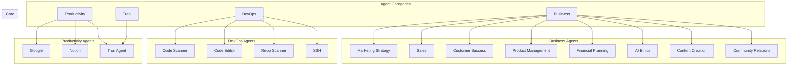
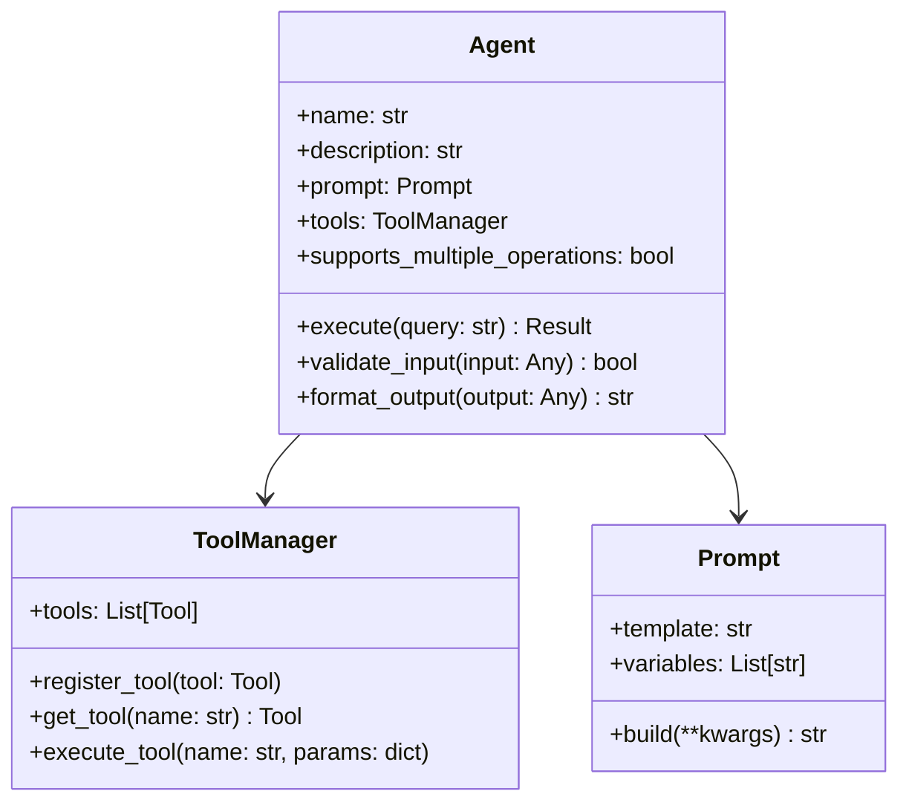
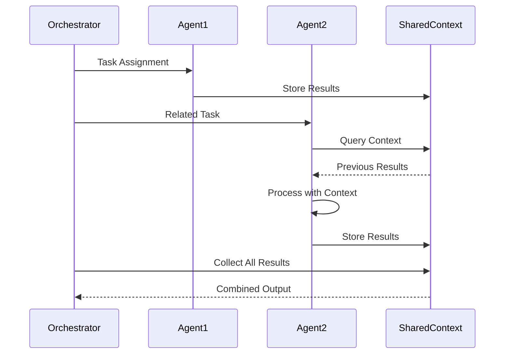
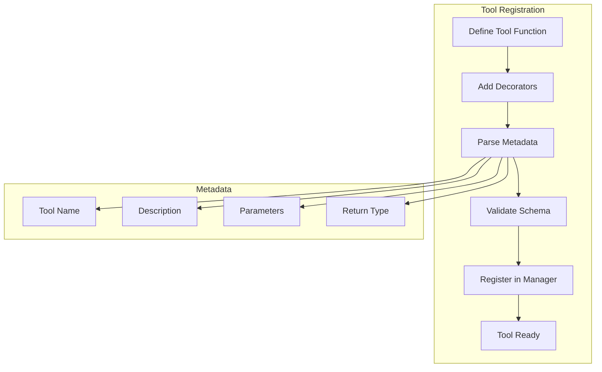
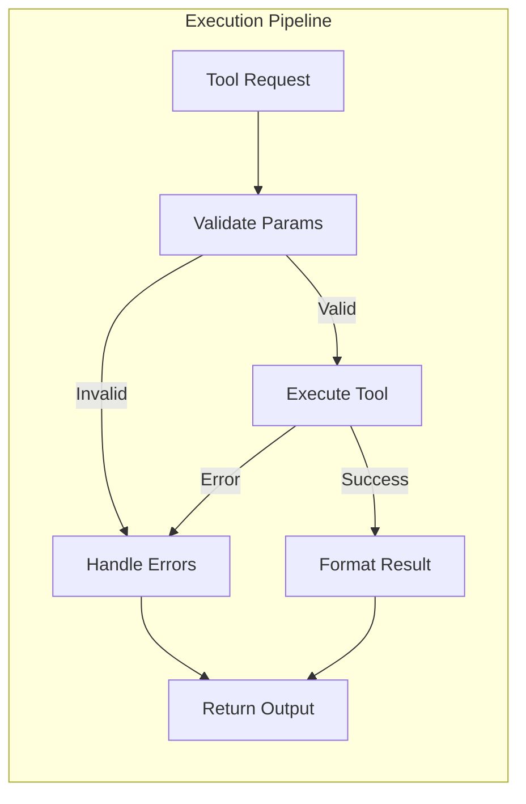
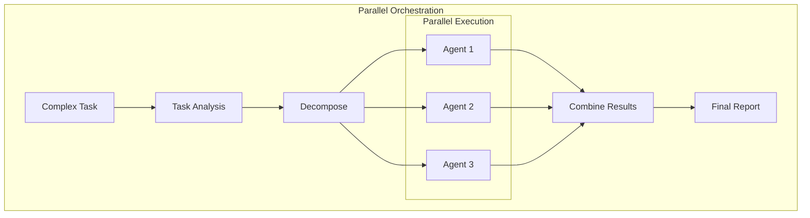
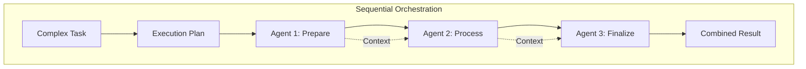
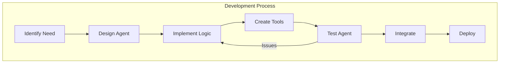
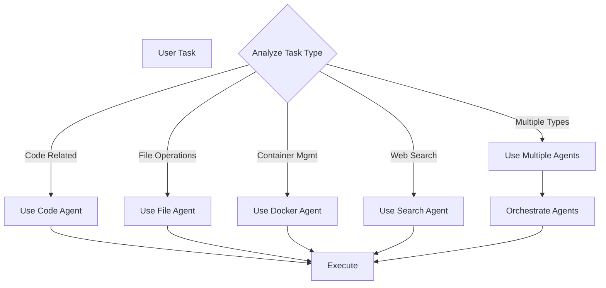

# Tron AI Agents Documentation

## Table of Contents

1. [Agent System Overview](#agent-system-overview)
2. [Agent Categories](#agent-categories)
3. [Core Agents](#core-agents)
4. [Agent Architecture](#agent-architecture)
5. [Tool Integration](#tool-integration)
6. [Agent Orchestration](#agent-orchestration)
7. [Creating Custom Agents](#creating-custom-agents)
8. [Best Practices](#best-practices)

## Agent System Overview

Tron AI's agent system is organized into categories for different domains: business, devops, productivity, and the core tron agent. Each agent is specialized for specific tasks and integrates with various tools and services.

### Agent Ecosystem



## Agent Categories

### Business Agents

Specialized for business operations and strategy:

- **Marketing Strategy Agent**: Develops marketing plans and content.
- **Sales Agent**: Handles sales processes and customer interactions.
- **Customer Success Agent**: Manages customer relationships and support.
- **Product Management Agent**: Oversees product development and roadmaps.
- **Financial Planning Agent**: Assists with budgeting and financial analysis.
- **AI Ethics Agent**: Ensures ethical AI practices.
- **Content Creation Agent**: Generates marketing and educational content.
- **Community Relations Agent**: Manages community engagement.

### DevOps Agents

Focused on development and operations:

- **Code Scanner Agent**: Analyzes code repositories.
- **Code Editor Agent**: Edits and modifies code.
- **Repo Scanner Agent**: Scans and maps repositories.
- **SSH Agent**: Manages remote server access.

### Productivity Agents

For personal and team productivity:

- **Google Agent**: Manages email and calendar.
- **Notion Agent**: Handles Notion workspace operations.
- **Todoist Agent**: Manages tasks and projects in Todoist.

### Tron Agent

The core orchestrator that can delegate to other agents via swarm execution.

## Core Agents

### Tron Agent

Main orchestrator using swarm for task delegation.

#### Tools
- execute_on_swarm
- query_memory

### Google Agent

Manages email and calendar.

#### Tools
- Various Google API tools (search_messages, get_message, etc.)

### Todoist Agent

Task management.

#### Tools
- Todoist API tools (get_tasks, create_task, etc.)

### Notion Agent

Knowledge management.

#### Tools
- Notion API tools (create_page, update_page, etc.)

<!-- Add similar sections for other agents with their tools from search results -->

## Agent Architecture

### Base Agent Structure



### Agent Communication



## Tool Integration

### Tool Registration Process



### Tool Execution Pipeline



## Agent Orchestration

Tron Agent uses swarm executor for orchestration.

### Parallel Execution Strategy



### Sequential Execution Strategy



## Creating Custom Agents

### Custom Agent Template

```python
from tron_ai.executors.agents.models.agent import Agent
from tron_ai.prompts.models import Prompt
from tron_ai.tools import ToolManager

class CustomAgent(Agent):
    """Custom agent for specific tasks."""
    
    def __init__(self):
        super().__init__(
            name="Custom Agent",
            description="Handles custom operations",
            prompt=Prompt(
                prompt="""You are a specialized agent that...
                
                Instructions:
                1. Analyze the request
                2. Use appropriate tools
                3. Provide detailed results
                
                User Query: {user_query}
                """,
                required_kwargs=["user_query"]
            ),
            supports_multiple_operations=True
        )
        
    @property
    def tools(self) -> ToolManager:
        """Define agent tools."""
        return ToolManager(tools=[
            self.custom_tool_1,
            self.custom_tool_2,
        ])
    
    def custom_tool_1(self, param1: str, param2: int) -> str:
        """First custom tool.
        
        Args:
            param1: Description
            param2: Description
            
        Returns:
            Tool result
        """
        # Implementation
        return f"Processed {param1} with {param2}"
```

### Agent Development Workflow



## Best Practices

### 1. Agent Selection

