# Tron AI Agents Documentation

## Table of Contents

1. [Agent System Overview](#agent-system-overview)
2. [Built-in Agents](#built-in-agents)
3. [Agent Architecture](#agent-architecture)
4. [Tool Integration](#tool-integration)
5. [Agent Orchestration](#agent-orchestration)
6. [Creating Custom Agents](#creating-custom-agents)
7. [Best Practices](#best-practices)

## Agent System Overview

The agent system in Tron AI provides specialized workers that handle specific types of tasks. Each agent has its own set of tools and expertise, allowing for efficient task decomposition and parallel execution.

### Agent Ecosystem

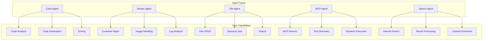

## Built-in Agents

### 1. Code Agent

The Code Agent specializes in code analysis, generation, and manipulation.

#### Capabilities

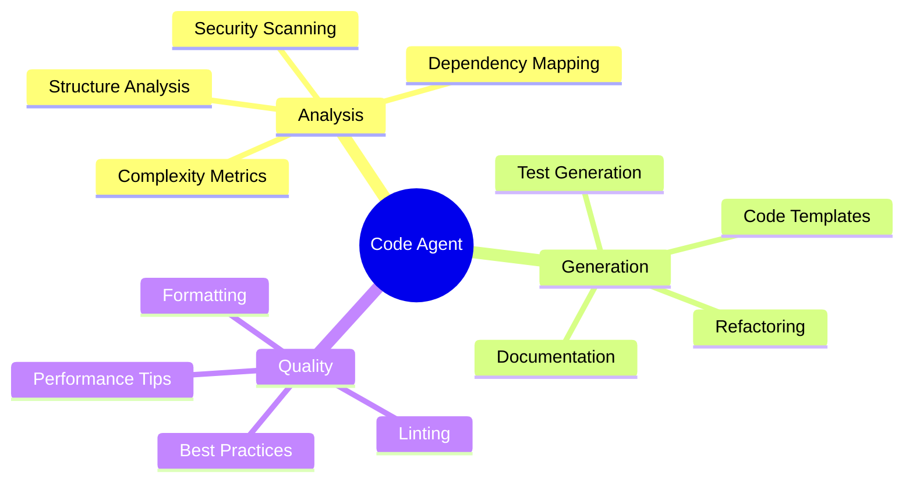

#### Tools

| Tool | Description | Parameters |
|------|-------------|------------|
| `analyze_code_structure` | Analyzes code organization | `code: str, language: str` |
| `check_code_quality` | Checks for issues and metrics | `code: str, language: str` |
| `format_code` | Formats code properly | `code: str, language: str` |
| `generate_tests` | Creates test cases | `code: str, language: str` |
| `analyze_dependencies` | Maps dependencies | `code: str, language: str` |
| `suggest_improvements` | Provides suggestions | `code: str, language: str` |

#### Example Usage

```python
# Via CLI
tron-ai agent "Analyze this Python module for security issues"

# Direct usage
from tron_intelligence.executors.agents.builtin import CodeAgent

agent = CodeAgent()
result = agent.analyze_code_structure(
    code=open("module.py").read(),
    language="python"
)
```

### 2. Docker Agent

Manages Docker containers and images with comprehensive container lifecycle management.

#### Architecture

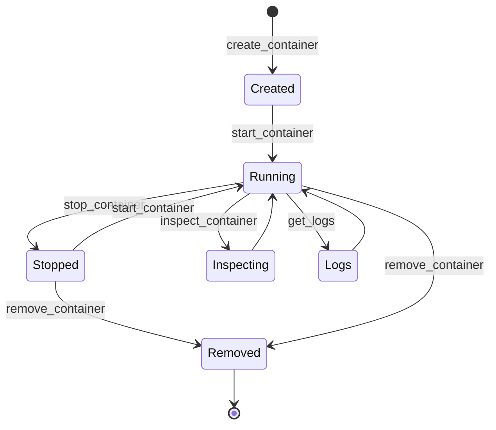

#### Tools

| Tool | Description | Parameters |
|------|-------------|------------|
| `list_containers` | Lists all containers | `all: bool = False` |
| `create_container` | Creates new container | `image: str, name: str, **kwargs` |
| `start_container` | Starts container | `container_id: str` |
| `stop_container` | Stops container | `container_id: str` |
| `remove_container` | Removes container | `container_id: str` |
| `get_logs` | Gets container logs | `container_id: str, tail: int` |
| `inspect_container` | Gets container details | `container_id: str` |

#### Container Management Flow

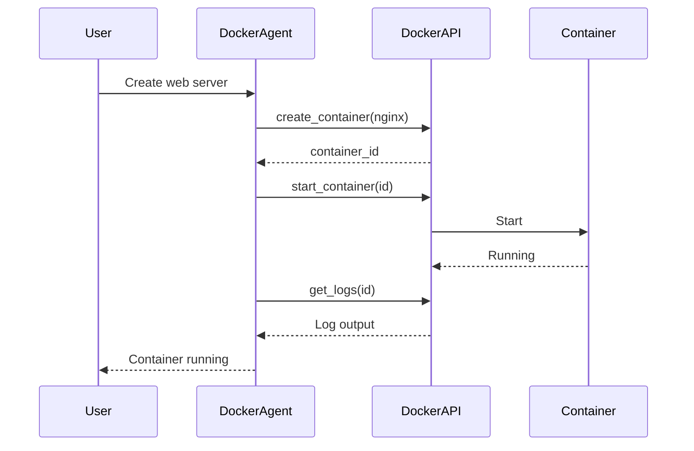

### 3. File Agent

Handles all file system operations with safety checks and validation.

#### File Operations

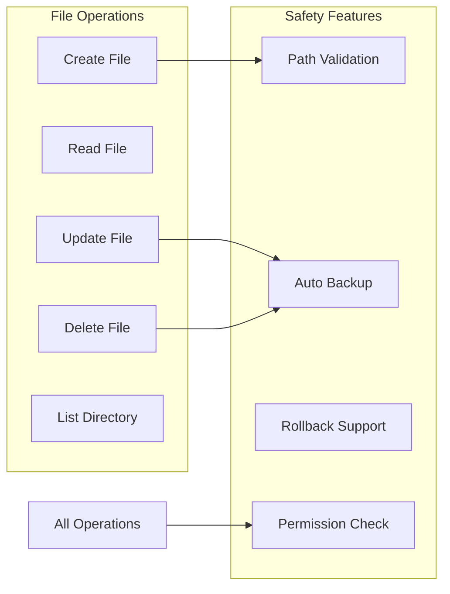

#### Tools

| Tool | Description | Parameters |
|------|-------------|------------|
| `create_file` | Creates new file | `path: str, content: str` |
| `read_file` | Reads file content | `path: str` |
| `update_file` | Updates file content | `path: str, content: str` |
| `delete_file` | Deletes file | `path: str` |
| `list_directory` | Lists directory contents | `path: str, recursive: bool` |

### 4. MCP Agent

Integrates with Model Context Protocol servers for dynamic tool loading. For multi-server management, use the MCP Agent Manager (see below).

#### MCP Integration Flow

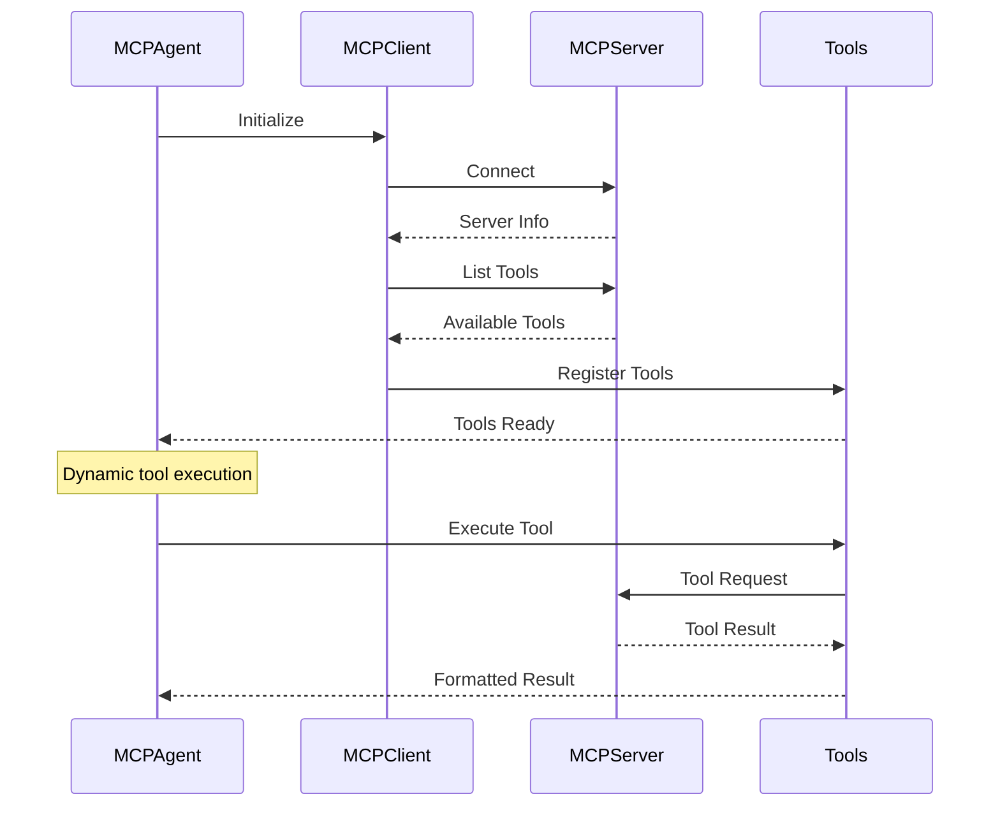

#### Dynamic Tool Discovery

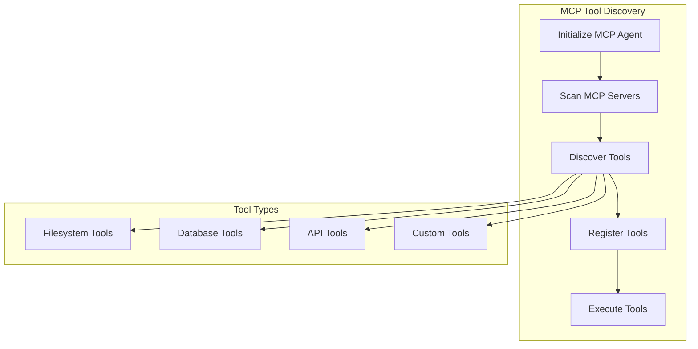

---

### 4a. MCP Agent Manager

The MCP Agent Manager (`MCPAgentManager`) is a singleton responsible for managing multiple MCP agents, each connected to a different MCP server. It provides a unified interface for initializing, adding, removing, and reloading MCP agents at runtime.

#### Key Features
- Singleton pattern for global access
- Manages a pool of named MCP agents
- Supports dynamic (re)loading from config files
- Async initialization and cleanup
- Default agent selection

#### Example Usage

```python
from tron_intelligence.executors.agents.builtin.mcp_agent_manager import MCPAgentManager

manager = MCPAgentManager()
await manager.initialize("mcp_servers.json")  # Load all agents from config

# Get default agent
agent = manager.get_default_agent()

# Get agent by name
agent = manager.get_agent("my-mcp-server")

# Add a new agent at runtime
await manager.add_agent("new-server", server_config)

# Remove an agent
await manager.remove_agent("old-server")

# Reload all agents from config
await manager.reload_agents("mcp_servers.json")

# Cleanup all agents
await manager.cleanup()
```

#### When to Use
- When you need to orchestrate multiple MCP servers
- For dynamic agent pool management in production
- To support hot-reloading of agent configs

---

### 5. Search Agent

Provides web search capabilities with result processing and content extraction.

#### Search Flow

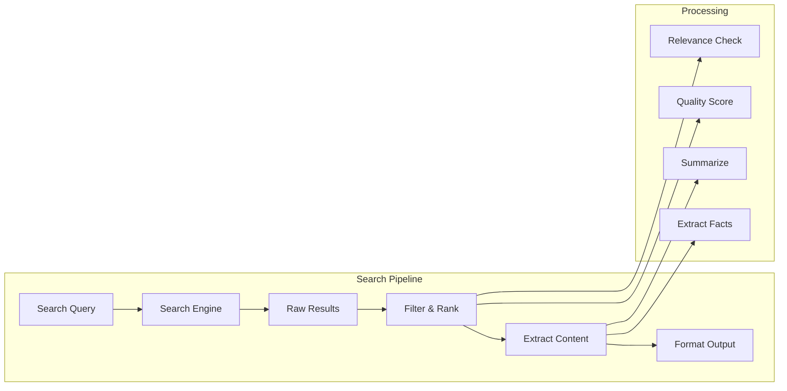

## Agent Architecture

### Base Agent Structure

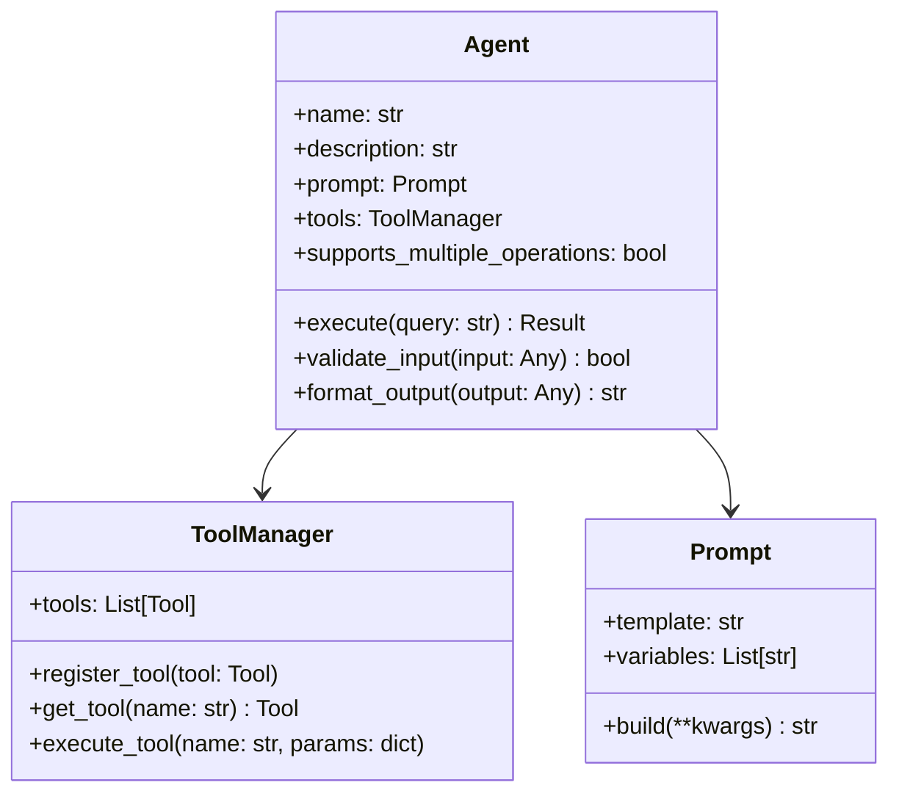

### Agent Communication

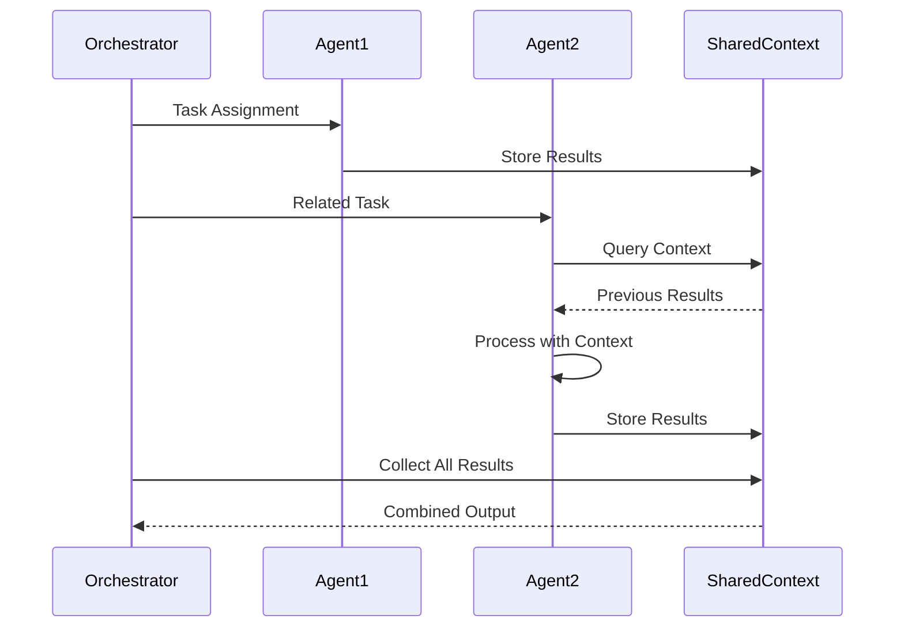

## Tool Integration

### Tool Registration Process

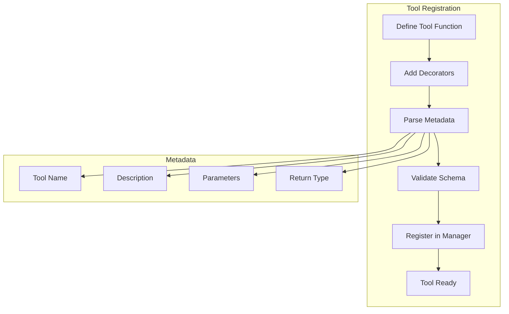

### Tool Execution Pipeline

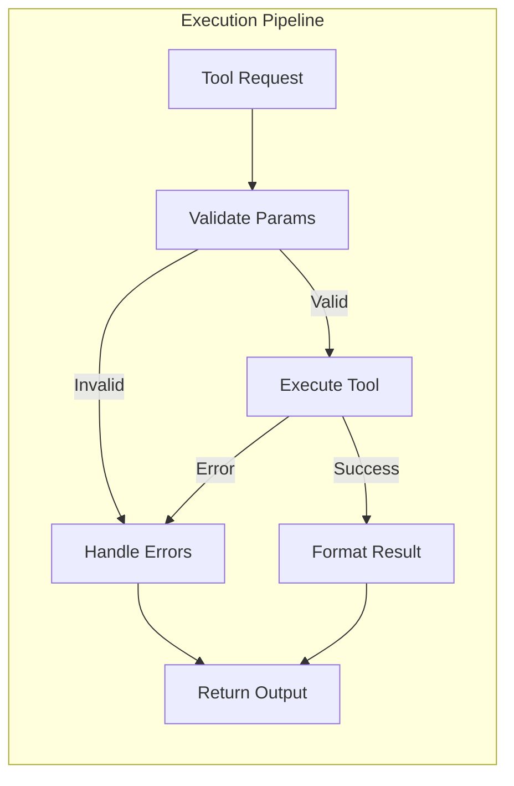

## Agent Orchestration

### Parallel Execution Strategy

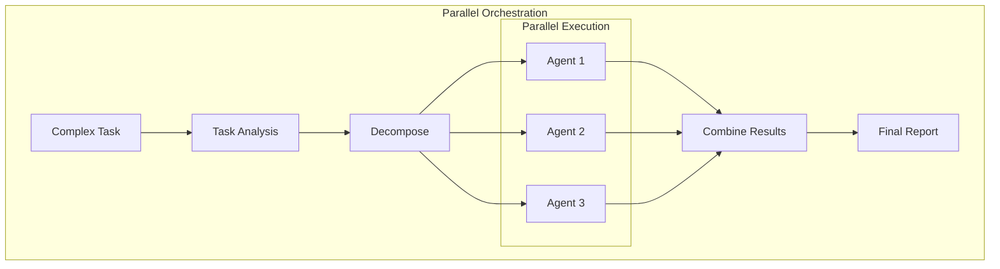

### Sequential Execution Strategy

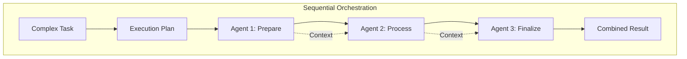

## Creating Custom Agents

### Custom Agent Template

```python
from tron_intelligence.executors.agents.models.agent import Agent
from tron_intelligence.prompts.models import Prompt
from tron_intelligence.tools import ToolManager

class CustomAgent(Agent):
    """Custom agent for specific tasks."""
    
    def __init__(self):
        super().__init__(
            name="Custom Agent",
            description="Handles custom operations",
            prompt=Prompt(
                prompt="""You are a specialized agent that...
                
                Instructions:
                1. Analyze the request
                2. Use appropriate tools
                3. Provide detailed results
                
                User Query: {user_query}
                """,
                required_kwargs=["user_query"]
            ),
            supports_multiple_operations=True
        )
        
    @property
    def tools(self) -> ToolManager:
        """Define agent tools."""
        return ToolManager(tools=[
            self.custom_tool_1,
            self.custom_tool_2,
        ])
    
    def custom_tool_1(self, param1: str, param2: int) -> str:
        """First custom tool.
        
        Args:
            param1: Description
            param2: Description
            
        Returns:
            Tool result
        """
        # Implementation
        return f"Processed {param1} with {param2}"
```

### Agent Development Workflow

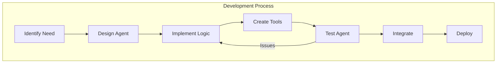

## Best Practices

### 1. Agent Selection

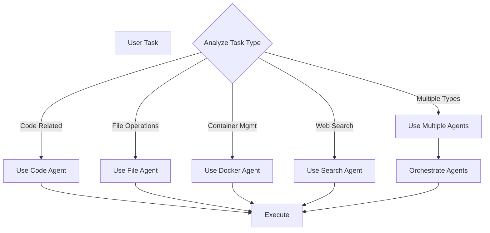

### 2. Error Handling

```python
# Agent error handling pattern
try:
    result = agent.execute(task)
except AgentError as e:
    # Handle agent-specific errors
    logger.error(f"Agent {e.agent_name} failed: {e.message}")
    # Fallback strategy
    result = fallback_agent.execute(task)
except Exception as e:
    # Handle unexpected errors
    logger.error(f"Unexpected error: {e}")
    raise
```

### 3. Performance Optimization

- **Use appropriate agents**: Don't use complex agents for simple tasks
- **Leverage parallelization**: Execute independent agents concurrently
- **Cache results**: Store and reuse results for similar queries
- **Limit scope**: Provide specific instructions to agents

### 4. Testing Agents

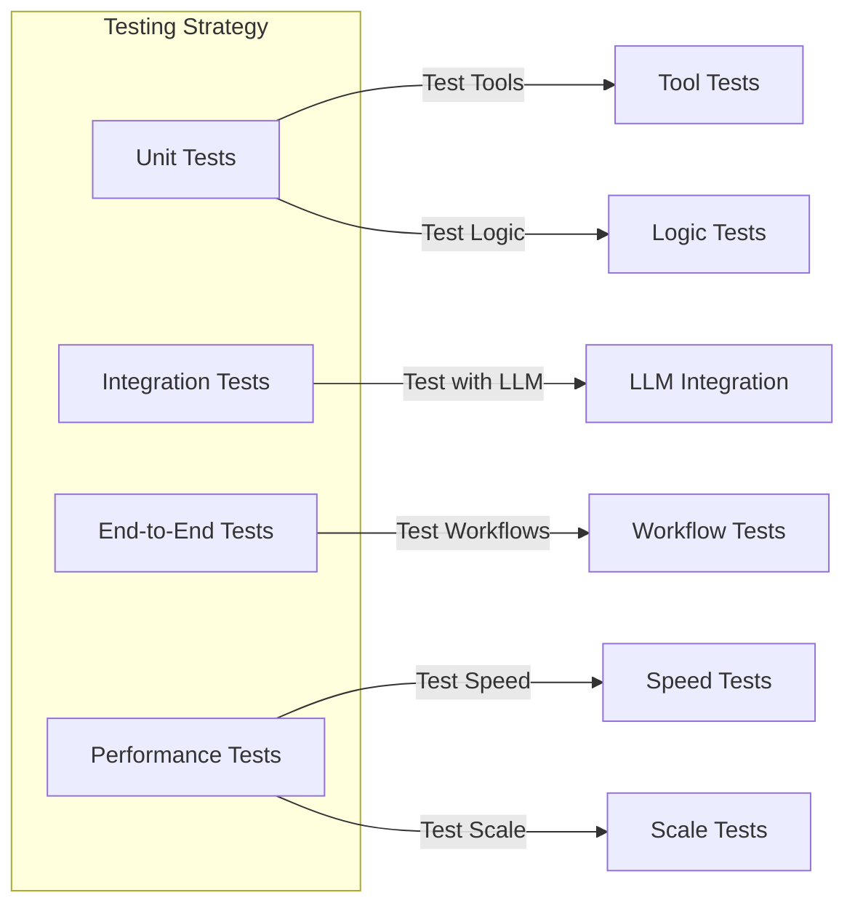

This documentation provides a comprehensive overview of the Tron AI agent system, including detailed information about each built-in agent, architecture patterns, and best practices for development and usage. 