# Tron AI Architecture Overview

## Table of Contents

1. [System Overview](#system-overview)
2. [Core Components](#core-components)
3. [Execution Flow](#execution-flow)
4. [Agent System](#agent-system)
5. [Memory Management](#memory-management)
6. [Tool System](#tool-system)
7. [Error Handling](#error-handling)

## System Overview

Tron AI is a modular AI orchestration framework that coordinates multiple specialized agents to solve complex tasks. The system is built on a layered architecture with clear separation of concerns.

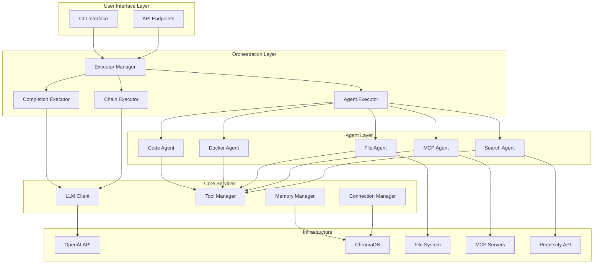

## Core Components

### 1. Executors

The executor pattern provides different strategies for task execution:

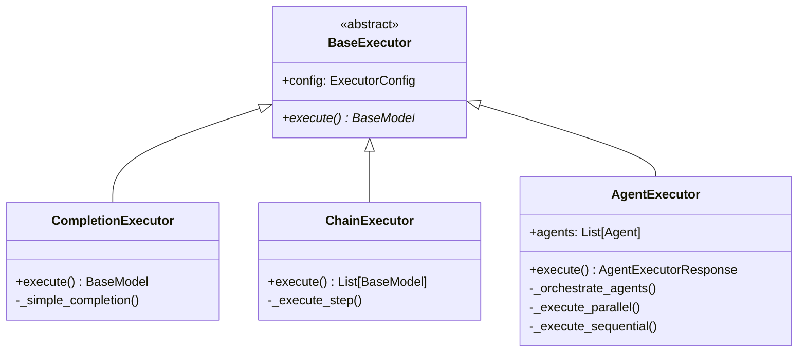

### 2. LLM Client Architecture

The LLM Client provides a unified interface for language model interactions:

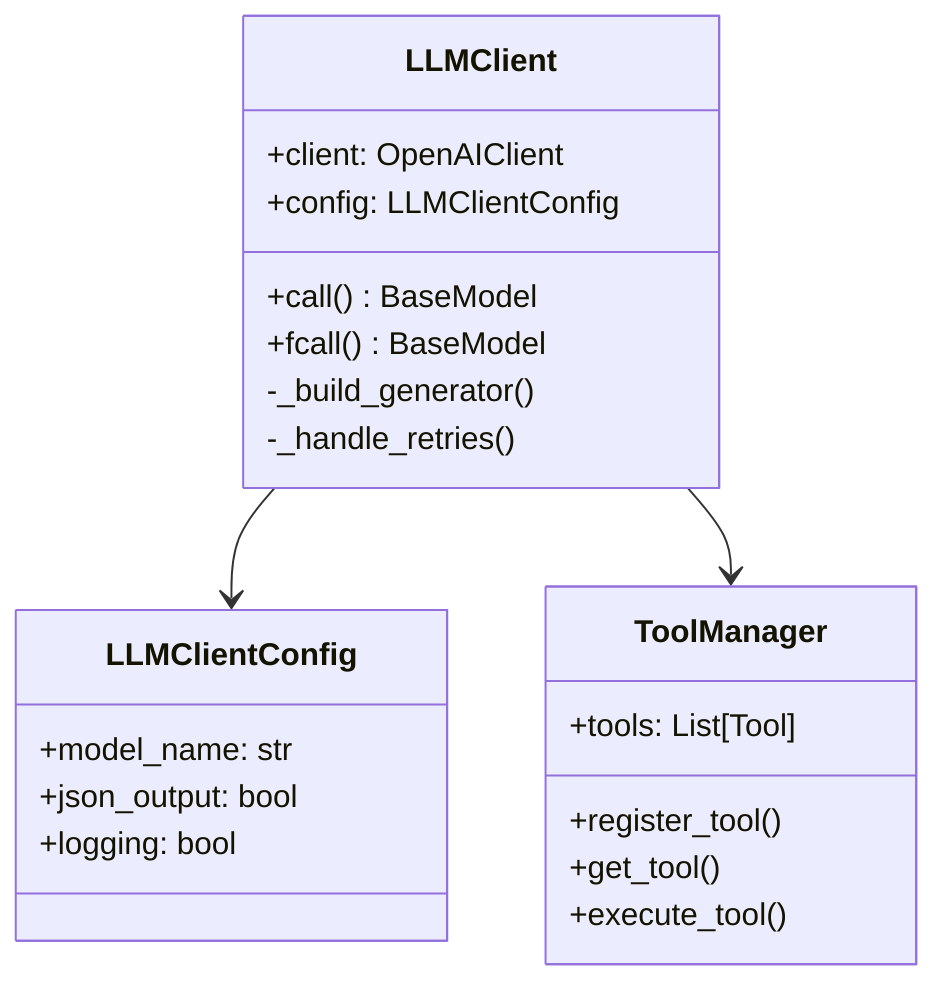

## Execution Flow

### Standard Request Flow

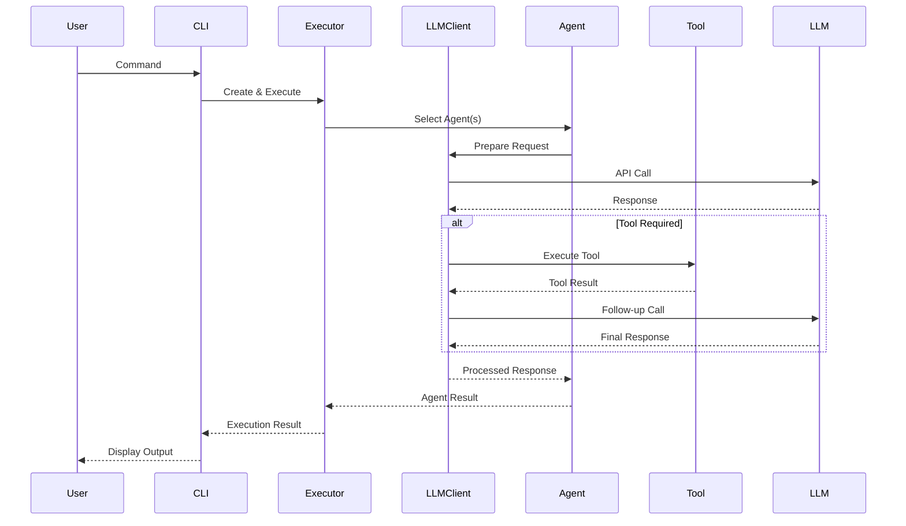

### Parallel Agent Execution

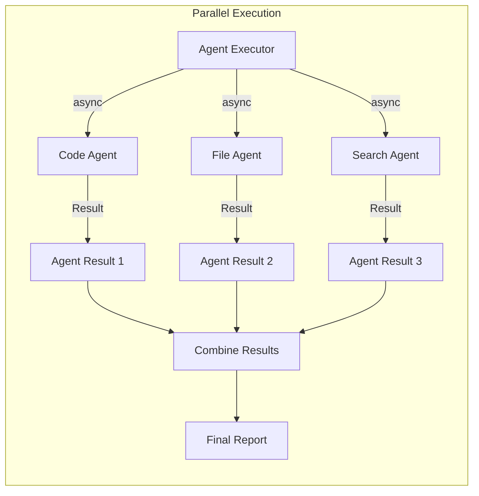

## Agent System

### Agent Hierarchy

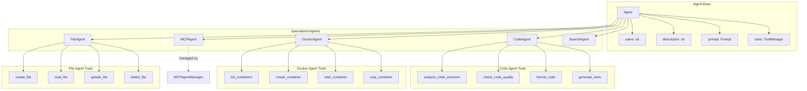

### Agent Selection Process

```mermaid
flowchart TD
    Start([User Query]) --> Parse[Parse Query Intent]
    Parse --> Analyze{Analyze Requirements}
    
    Analyze -->|Code Related| SelectCode[Select Code Agent]
    Analyze -->|File Operations| SelectFile[Select File Agent]
    Analyze -->|Docker Tasks| SelectDocker[Select Docker Agent]
    Analyze -->|Web Search| SelectSearch[Select Search Agent]
    Analyze -->|MCP Operations| SelectMCP[Select MCP Agent]
    Analyze -->|Multiple Needs| SelectMultiple[Select Multiple Agents]
    
    SelectCode --> Execute[Execute Agent(s)]
    SelectFile --> Execute
    SelectDocker --> Execute
    SelectSearch --> Execute
    SelectMCP --> Execute
    SelectMultiple --> ParallelExec{Parallel Execution?}
    
    ParallelExec -->|Yes| AsyncExec[Async Execution]
    ParallelExec -->|No| SeqExec[Sequential Execution]
    
    AsyncExec --> Execute
    SeqExec --> Execute
    
    Execute --> Results[Combine Results]
    Results --> End([Return Response])
```

## Memory Management

### Memory System Architecture

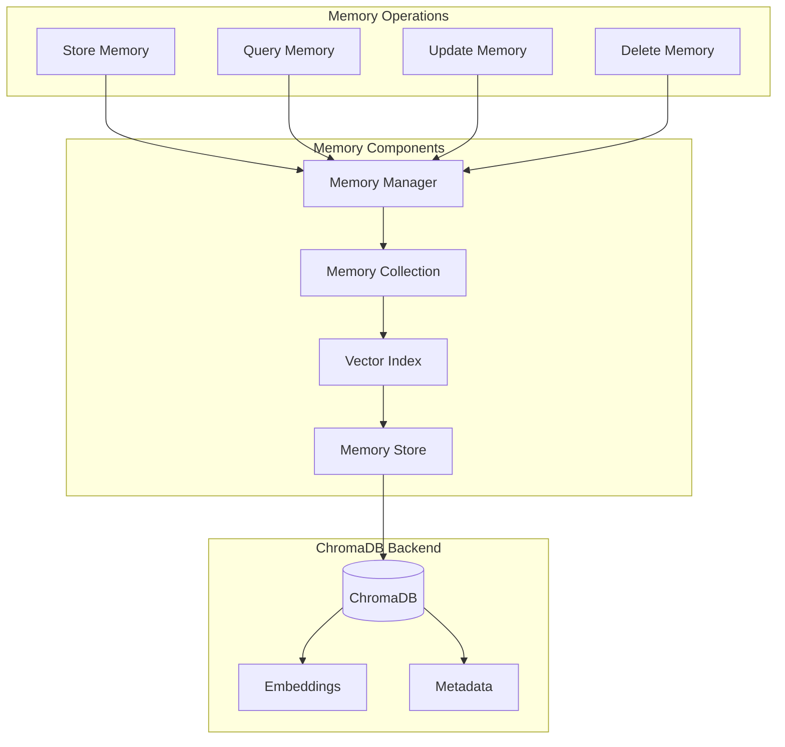

### Memory Query Flow

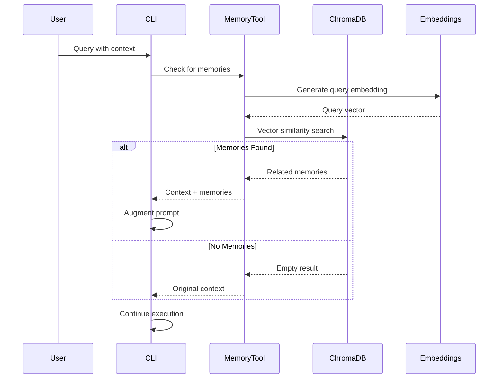

## Tool System

### Tool Manager Architecture

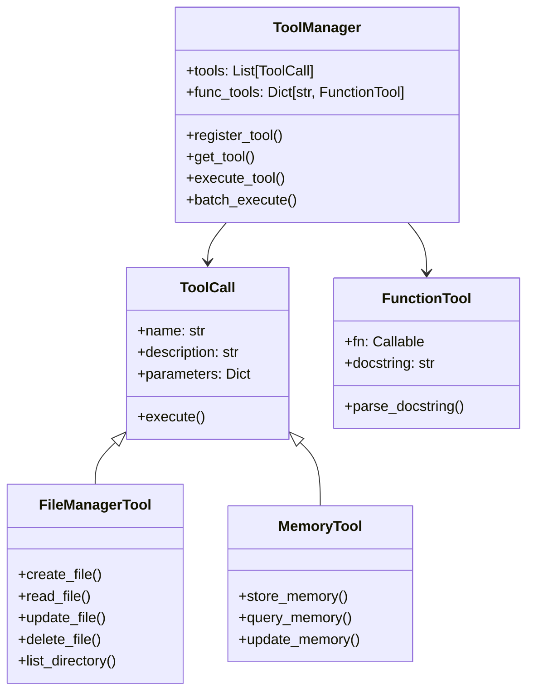

### Tool Execution Pipeline

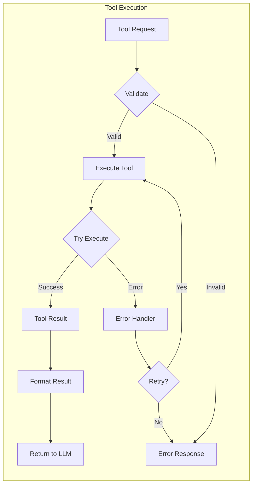

## Error Handling

### Exception Hierarchy

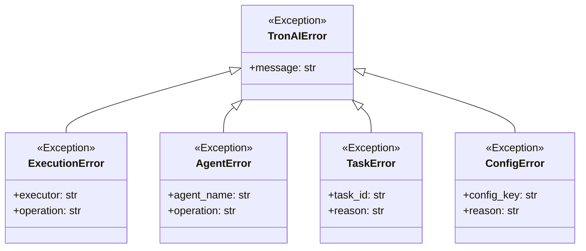

### Error Handling Flow

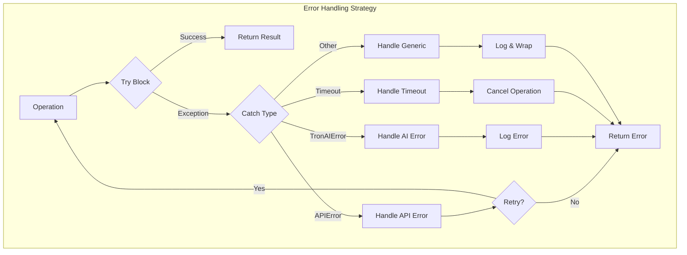

## Configuration Management

### Configuration Flow

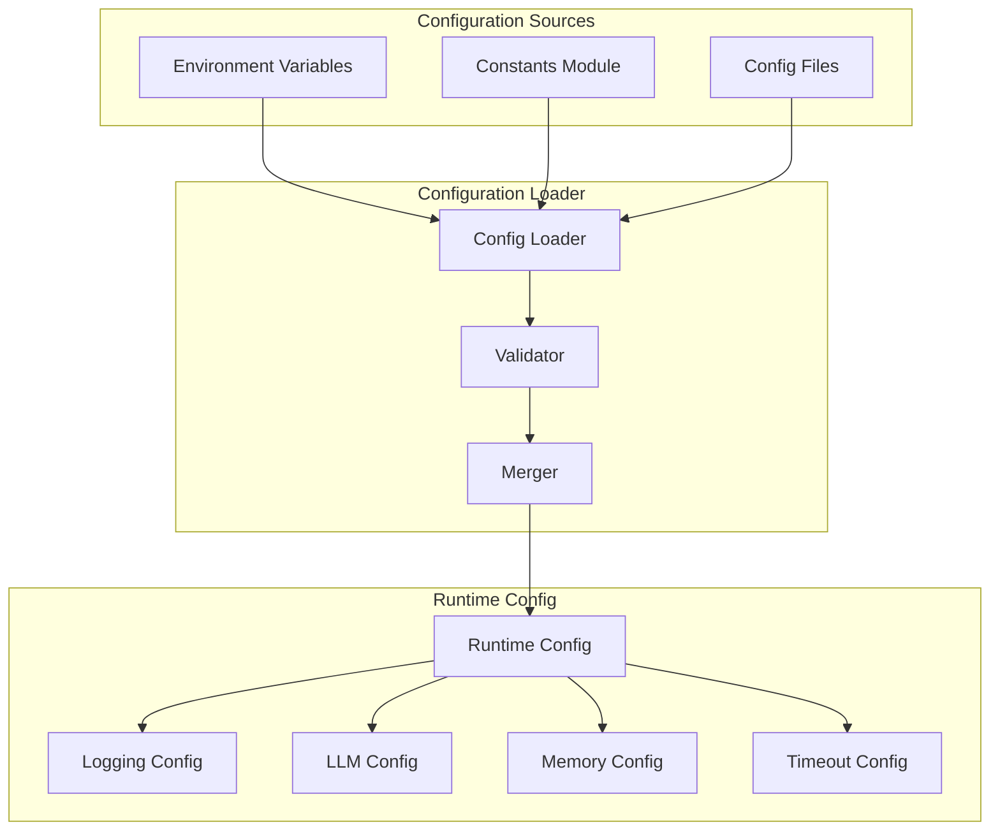

## Deployment Architecture

### Container Architecture

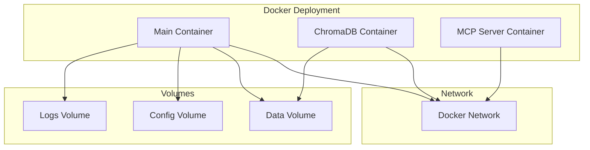

This architecture documentation provides a comprehensive overview of the Tron AI system, showing how components interact and data flows through the system. 