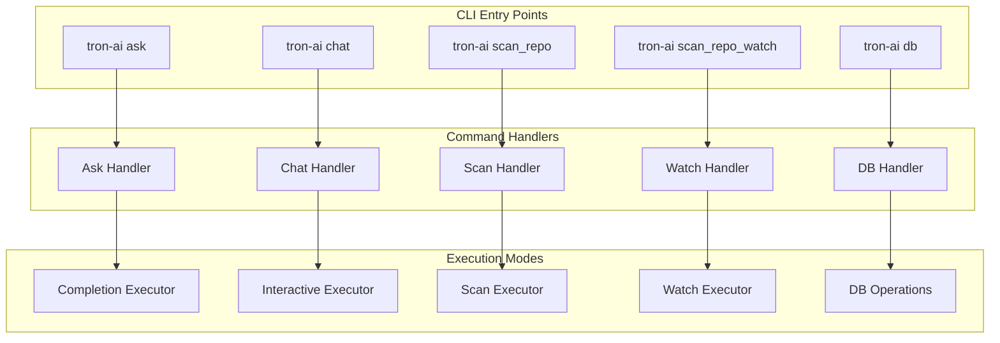
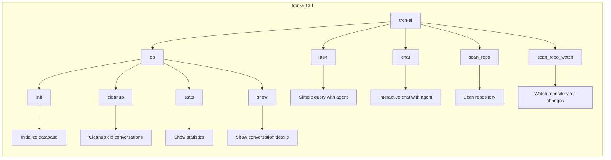
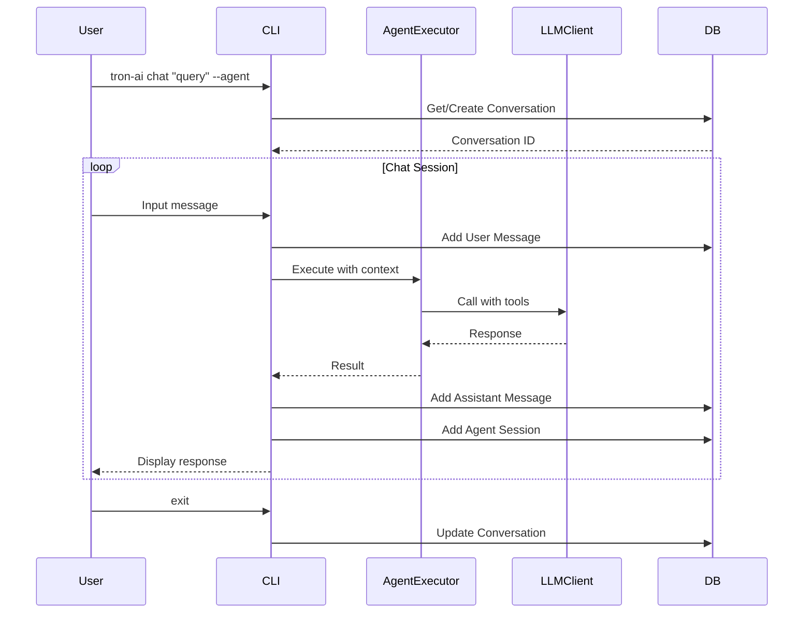
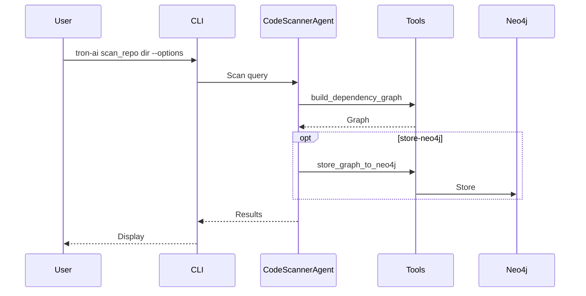

# Tron AI CLI Guide

## Table of Contents

1. [Overview](#overview)
2. [Installation & Setup](#installation--setup)
3. [CLI Commands](#cli-commands)
4. [Command Flow Diagrams](#command-flow-diagrams)
5. [Usage Examples](#usage-examples)
6. [Advanced Features](#advanced-features)
7. [Troubleshooting](#troubleshooting)

## Overview

The Tron AI CLI provides an interface for interacting with AI agents for various tasks including productivity, development, and business operations. It supports single queries, interactive chats, repository scanning, and database management for conversation history.

### CLI Architecture



## Installation & Setup

### Prerequisites

```bash
# Python 3.12 or higher required
python --version

# Create virtual environment
python -m venv .venv
source .venv/bin/activate  # On Windows: .venv\Scripts\activate

# Install with uv (recommended)
uv sync

# Or install with pip
pip install -e .
```

### Environment Configuration

```bash
# Create .env file
cat > .env << EOF
# Required
OPENAI_API_KEY=your-openai-api-key

# Optional for specific agents
GROQ_API_KEY=your-groq-api-key  # For chat command
TODOIST_API_TOKEN=your-todoist-token
NOTION_API_TOKEN=your-notion-token
GOOGLE_APPLICATION_CREDENTIALS=path/to/credentials.json

# Logging
TRON_LOG_LEVEL_ROOT=WARNING
TRON_LOG_LEVEL_tron-ai=INFO
EOF
```

## CLI Commands

### Command Overview



### 1. Ask Command

Execute a single query with an agent.

```bash
# Basic usage
tron-ai ask "What is quantum computing?" --agent generic

# With specific agent
tron-ai ask "Check my emails" --agent google

# Available agents: generic, tron, google
```

### 2. Chat Command

Start an interactive chat session with an agent.

```bash
# Start with initial query
tron-ai chat "Tell me about AI" --agent tron

# Available agents: generic, tron, google, ssh, todoist, notion, marketing_strategy, sales, customer_success, product_management, financial_planning, ai_ethics, content_creation, community_relations
```

### 3. Scan Repo Command

Scan a local repository and build dependency graph.

```bash
# Basic scan
tron-ai scan_repo /path/to/repo

# With output
tron-ai scan_repo /path/to/repo --output graph.json

# Store in Neo4j
tron-ai scan_repo /path/to/repo --store-neo4j
```

### 4. Scan Repo Watch Command

Watch and periodically scan a repository for updates.

```bash
# Basic watch
tron-ai scan_repo_watch /path/to/repo

# With interval
tron-ai scan_repo_watch /path/to/repo --interval 60

# Store updates in Neo4j
tron-ai scan_repo_watch /path/to/repo --store-neo4j
```

### 5. DB Commands

Manage the conversation history database.

```bash
# Initialize database
tron-ai db init

# Cleanup old conversations
tron-ai db cleanup --days 30

# Show statistics
tron-ai db stats --days 7

# Show specific conversation
tron-ai db show <session_id>
```

## Command Flow Diagrams

### Chat Command Flow



### Scan Repo Flow



## Usage Examples

### Interactive Chat with Agent

```bash
# Start chat with Tron agent
tron-ai chat "Help me plan my day" --agent tron

# Chat with Todoist agent
tron-ai chat "Show my tasks" --agent todoist
```

### Repository Scanning

```bash
# Scan and store graph
tron-ai scan_repo . --output repo_graph.json --store-neo4j
```

### Database Management

```bash
# View stats
tron-ai db stats --agent tron --days 7

# Cleanup
tron-ai db cleanup --days 90
```

## Advanced Features

### Agent Selection

Different agents provide specialized capabilities:
- **tron**: General AI assistant
- **google**: Email and calendar management
- **todoist**: Task management
- **notion**: Knowledge management
- Business agents: marketing_strategy, sales, etc.

### Database Integration

All chat sessions are stored in SQLite database for history and analytics.

## Troubleshooting

### Common Issues

#### Missing API Keys

Ensure required environment variables are set for specific agents.

#### Database Errors

Run `tron-ai db init` to initialize database.

#### Connection Issues

Check logging levels and environment configuration. 