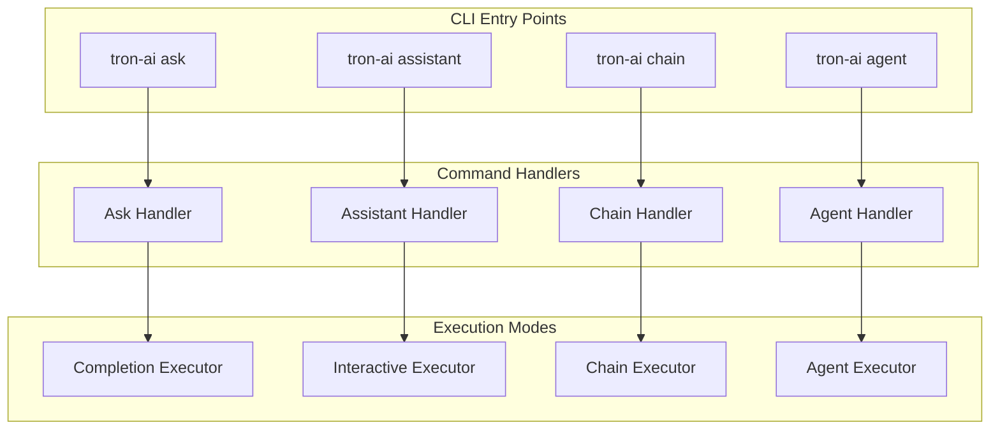
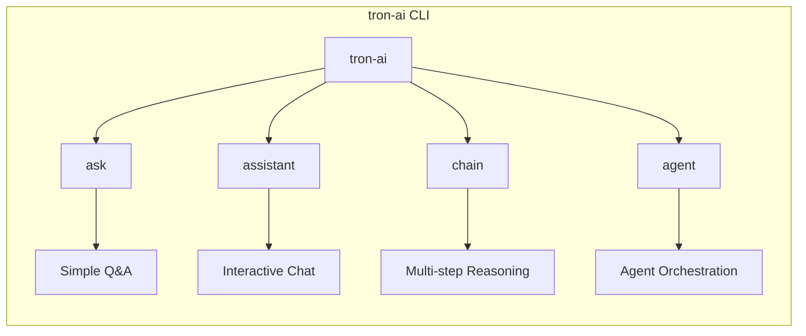
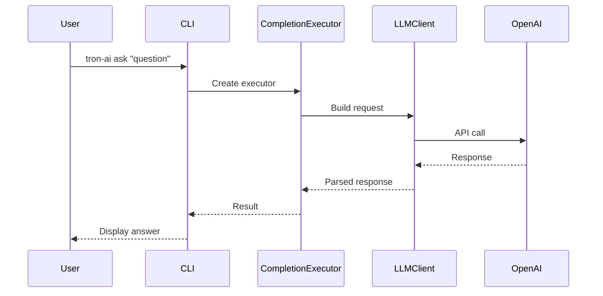
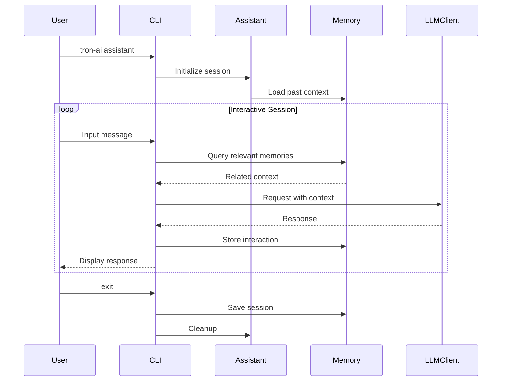
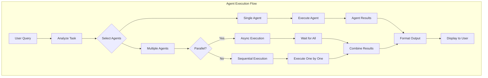
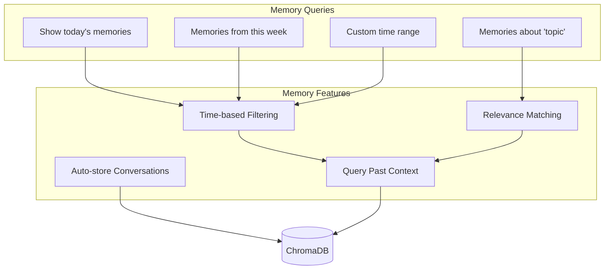
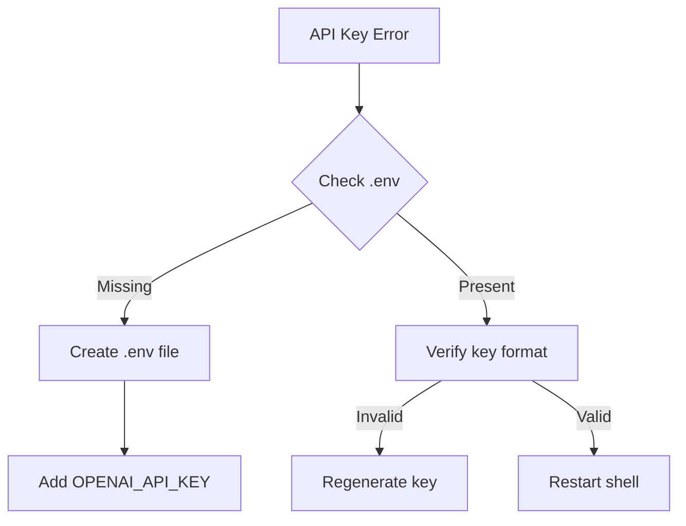
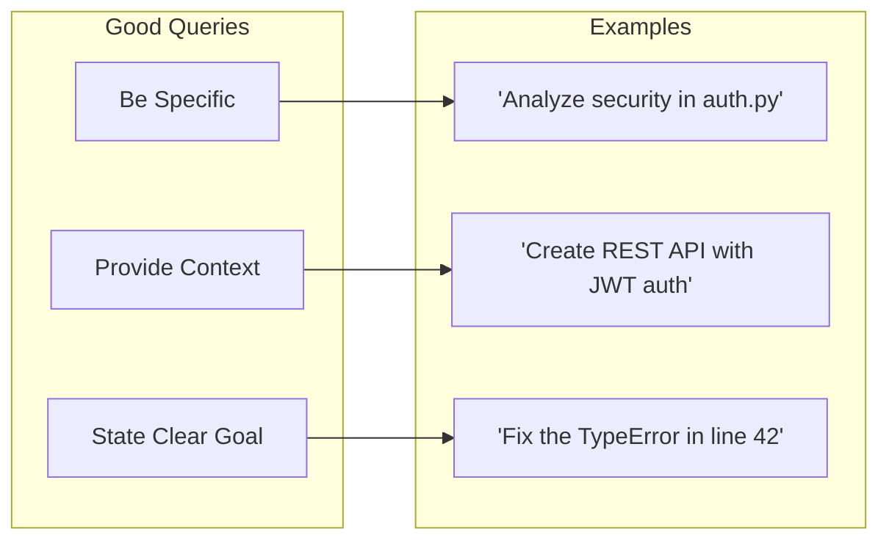

# Tron AI CLI Guide

## Table of Contents

1. [Overview](#overview)
2. [Installation & Setup](#installation--setup)
3. [CLI Commands](#cli-commands)
4. [Command Flow Diagrams](#command-flow-diagrams)
5. [Usage Examples](#usage-examples)
6. [Advanced Features](#advanced-features)
7. [Troubleshooting](#troubleshooting)

## Overview

The Tron AI CLI provides a powerful interface for interacting with the AI orchestration framework. It supports multiple execution modes, from simple completions to complex multi-agent tasks.

### CLI Architecture



## Installation & Setup

### Prerequisites

```bash
# Python 3.12 or higher required
python --version

# Create virtual environment
python -m venv .venv
source .venv/bin/activate  # On Windows: .venv\Scripts\activate

# Install tron-ai
pip install -e .
```

### Environment Configuration

```bash
# Create .env file
cat > .env << EOF
# Required
OPENAI_API_KEY=your-openai-api-key

# Optional
PERPLEXITY_API_KEY=your-perplexity-api-key

# Logging
TRON_LOG_LEVEL_ROOT=WARNING
TRON_LOG_LEVEL_tron_intelligence=INFO
EOF
```

## CLI Commands

### Command Overview



### 1. Ask Command

Simple one-off questions without context retention.

```bash
# Basic usage
tron-ai ask "What is quantum computing?"

# With custom model
tron-ai ask "Explain machine learning" --model gpt-4o

# With structured output
tron-ai ask "List 5 Python best practices" --json
```

### 2. Assistant Command

Interactive chat with memory persistence.

```bash
# Start interactive session
tron-ai assistant

# Start with initial query
tron-ai assistant "Tell me about AI"

# With custom settings
tron-ai assistant --model gpt-4o --memory-limit 10
```

### 3. Chain Command

Execute multi-step reasoning chains.

```bash
# Start chain execution
tron-ai chain

# The CLI will guide you through:
# 1. Defining the goal
# 2. Breaking down into steps
# 3. Executing each step
# 4. Combining results
```

### 4. Agent Command

Execute complex tasks using specialized agents.

```bash
# Basic agent execution
tron-ai agent "Analyze the Python files in this directory"

# With specific agents
tron-ai agent "Create a web scraper" --agents code,file

# Parallel execution
tron-ai agent "Analyze and document this codebase" --parallel
```

## Command Flow Diagrams

### Ask Command Flow



### Assistant Command Flow



### Agent Command Flow



## Usage Examples

### Example 1: Code Analysis

```bash
# Analyze a Python file
tron-ai agent "Analyze app.py for security issues and performance"

# Output includes:
# - Security vulnerabilities found
# - Performance bottlenecks
# - Suggested improvements
# - Code quality metrics
```

### Example 2: Project Documentation

```bash
# Generate comprehensive documentation
tron-ai agent "Create documentation for this Python project"

# The agent will:
# 1. Scan all Python files
# 2. Extract docstrings and comments
# 3. Analyze code structure
# 4. Generate README sections
# 5. Create API documentation
```

### Example 3: Interactive Learning

```bash
# Start learning session
tron-ai assistant "I want to learn about machine learning"

# You can then ask follow-up questions:
> "What are neural networks?"
> "Show me a simple example in Python"
> "What are the prerequisites?"
> "Recommend learning resources"
```

### Example 4: Complex Task Orchestration

```bash
# Multi-agent task
tron-ai agent "Create a REST API with authentication and tests"

# Agents coordinate to:
# - CodeAgent: Generate API structure
# - FileAgent: Create necessary files
# - CodeAgent: Implement authentication
# - CodeAgent: Generate tests
# - DockerAgent: Create Dockerfile
```

## Advanced Features

### Memory Management



### Tool Integration

```bash
# List available tools
tron-ai tools list

# Execute with specific tools
tron-ai agent "Task" --tools file_manager,memory

# Disable certain tools
tron-ai agent "Task" --disable-tools docker
```

### Logging Configuration

```bash
# Set logging levels via environment
export TRON_LOG_LEVEL_ROOT=WARNING
export TRON_LOG_LEVEL_tron_intelligence=DEBUG
export TRON_LOG_LEVEL_ADALFLOW=INFO

# Or use CLI flags
tron-ai --log-level DEBUG agent "Task"
```

## Troubleshooting

### Common Issues

#### 1. API Key Errors



#### 2. Memory Errors

```bash
# Reset memory database
rm -rf chroma/

# Reinitialize
tron-ai assistant "Hello"  # Will create new DB
```

#### 3. Timeout Issues

```bash
# Increase timeout for long operations
export TIMEOUT_MCP_AGENT=300  # 5 minutes
export TIMEOUT_COMPLETION=120  # 2 minutes
```

### Debug Mode

```bash
# Enable debug output
tron-ai --debug agent "Complex task"

# View detailed logs
tail -f logs/tron-ai.log
```

### Performance Tips

1. **Use appropriate executors**
   - `ask` for simple questions
   - `assistant` for conversational tasks
   - `agent` for complex operations

2. **Optimize agent selection**
   ```bash
   # Specify only needed agents
   tron-ai agent "Write Python code" --agents code,file
   ```

3. **Leverage parallelization**
   ```bash
   # For independent tasks
   tron-ai agent "Analyze multiple files" --parallel
   ```

## Best Practices

### 1. Query Formulation



### 2. Memory Usage

- Use memory for context-dependent tasks
- Clear memory periodically for performance
- Query specific time ranges when needed

### 3. Error Handling

- Always check logs for detailed errors
- Use debug mode for complex issues
- Report persistent errors with logs

## Integration Examples

### Shell Scripts

```bash
#!/bin/bash
# analyze_project.sh

# Analyze all Python files
for file in $(find . -name "*.py"); do
    echo "Analyzing $file..."
    tron-ai agent "Analyze $file for issues" --quiet
done
```

### Python Integration

```python
import subprocess
import json

def analyze_code(filepath):
    """Use Tron AI to analyze code."""
    result = subprocess.run(
        ["tron-ai", "agent", f"Analyze {filepath}", "--json"],
        capture_output=True,
        text=True
    )
    return json.loads(result.stdout)

# Usage
analysis = analyze_code("app.py")
print(analysis["security_issues"])
```

This guide provides comprehensive coverage of the Tron AI CLI, from basic usage to advanced features and troubleshooting. 