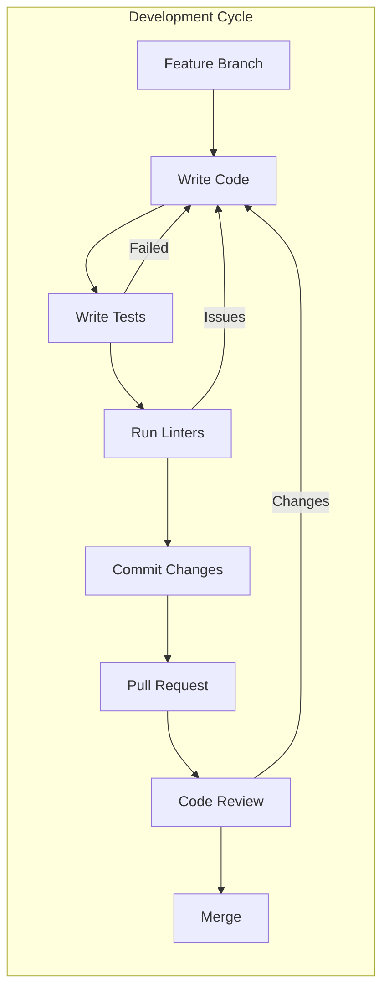
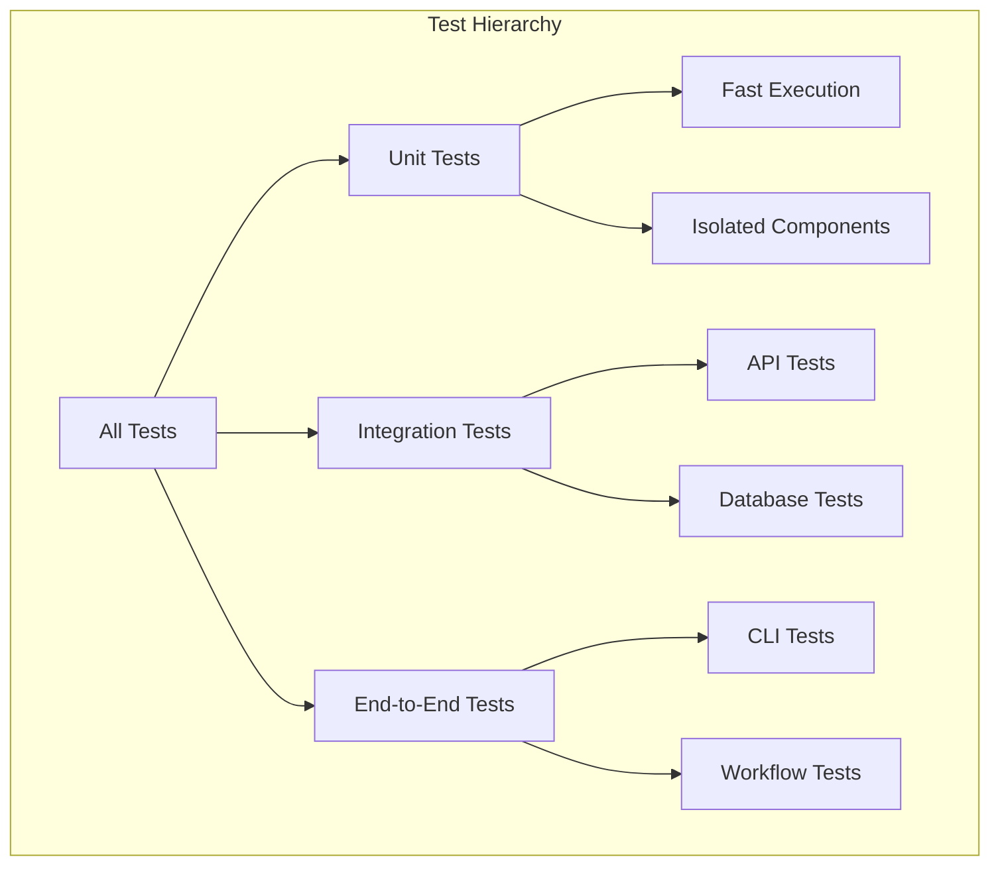
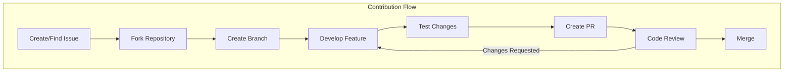
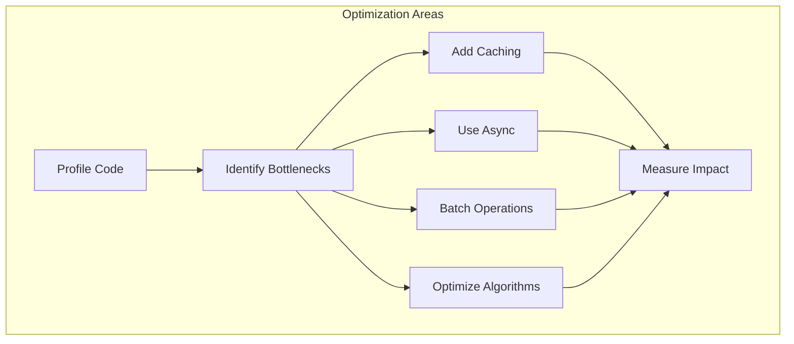

# Tron AI Development Guide

## Table of Contents

1. [Development Setup](#development-setup)
2. [Project Structure](#project-structure)
3. [Development Workflow](#development-workflow)
4. [Testing](#testing)
5. [Code Standards](#code-standards)
6. [Contributing](#contributing)
7. [Debugging](#debugging)
8. [Performance Optimization](#performance-optimization)

## Development Setup

### Prerequisites

- Python 3.12 or higher
- Git
- Docker (optional, for container features)
- Make (optional, for convenience commands)

### Initial Setup

```bash
# Clone the repository
git clone https://github.com/yourusername/tron-ai.git
cd tron-ai

# Create virtual environment
python -m venv .venv
source .venv/bin/activate  # On Windows: .venv\Scripts\activate

# Install in development mode (recommended)
uv sync

# Or install with pip
pip install -e ".[dev,test]"

# Install pre-commit hooks (if available)
pre-commit install
```

### Environment Configuration

The application automatically loads environment variables from a `.env` file in the project root. Copy the example file and configure your settings:

```bash
# Copy the example environment file
cp .env.example .env

# Edit the .env file with your actual values
```

#### Required Environment Variables

```bash
# OpenAI API Key (Required for most agents)
OPENAI_API_KEY=your-openai-api-key-here

# Groq API Key (Required for chat command)
GROQ_API_KEY=your-groq-api-key-here
```

#### Optional Environment Variables

```bash
# Perplexity API Key (for product management agent)
PERPLEXITY_API_KEY=your-perplexity-api-key-here

# Todoist API Token (for todoist agent)
TODOIST_API_TOKEN=your-todoist-api-token-here

# Notion API Token (for notion agent)
NOTION_API_TOKEN=your-notion-api-token-here

# Google Application Credentials (for Google agent)
GOOGLE_APPLICATION_CREDENTIALS=path/to/your/google-credentials.json
```

#### Development Settings

```bash
# Logging configuration
TRON_LOG_LEVEL_ROOT=WARNING
TRON_LOG_LEVEL_tron_ai=DEBUG
TRON_LOG_LEVEL_THIRD_PARTY=WARNING

# Development mode
TRON_DEV_MODE=false
```

#### Custom .env File Location

You can also specify a custom .env file location programmatically:

```python
from tron_ai.config import load_env_file

# Load from a specific path
load_env_file("/path/to/your/.env")
```

## Project Structure

Based on current layout:

tron-ai/
├── tron_ai/
│   ├── agents/
│   │   ├── business/
│   │   ├── devops/
│   │   ├── productivity/
│   │   ├── tron/
│   ├── cli.py
│   ├── config.py
│   ├── constants.py
│   ├── database/
│   ├── exceptions.py
│   ├── executors/
│   │   ├── swarm/
│   ├── models/
│   ├── modules/
│   │   ├── a2a/
│   │   ├── mcp/
│   │   ├── ssh/
│   │   ├── tasks/
│   ├── processors/
│   ├── utils/
│   ├── vendor/
└── ...

### Directory Structure Details

```
tron-ai/
├── tron-ai/                    # Main package
│   ├── __init__.py            # Package initialization
│   ├── cli.py                 # CLI entry point
│   ├── config.py              # Configuration management
│   ├── constants.py           # Global constants
│   ├── exceptions.py          # Custom exceptions
│   ├── executors/             # Execution strategies
│   │   ├── base.py           # Abstract base executor
│   │   ├── completion.py     # Simple completion
│   │   ├── chain.py          # Chain execution
│   │   └── agents/           # Agent implementations
│   │       ├── executor.py   # Agent executor
│   │       ├── builtin/      # Built-in agents
│   │       └── models/       # Agent models
│   ├── models/                # Data models
│   ├── prompts/               # Prompt templates
│   │   ├── models.py         # Prompt models
│   │   └── res/              # Prompt resources
│   ├── tools/                 # Tool implementations
│   └── utils/                 # Utility modules
├── tests/                     # Test suite
│   ├── conftest.py           # Test fixtures
│   ├── executors/            # Executor tests
│   ├── models/               # Model tests
│   └── utils/                # Utility tests
├── docs/                      # Documentation
├── .env.example              # Environment template
├── .gitignore                # Git ignore rules
├── Makefile                  # Make commands
├── pyproject.toml            # Project configuration
└── README.md                 # Project README
```

## Development Workflow

### Standard Development Flow



### Git Workflow

```bash
# Create feature branch
git checkout -b feature/your-feature-name

# Make changes
# ... edit files ...

# Run tests
make test

# Format code
make ruff-format

# Commit changes
git add .
git commit -m "feat: add new feature"

# Push branch
git push origin feature/your-feature-name
```

### Commit Message Convention

Follow conventional commits format:

```
<type>(<scope>): <subject>

<body>

<footer>
```

Types:
- `feat`: New feature
- `fix`: Bug fix
- `docs`: Documentation changes
- `style`: Code style changes
- `refactor`: Code refactoring
- `test`: Test additions/changes
- `chore`: Build/tool changes

Example:
```
feat(agents): add custom tool support

- Implement dynamic tool registration
- Add tool validation
- Update agent base class

Closes #123
```

## Testing

### Test Structure



### Running Tests

```bash
# Run all tests
make test

# Run with coverage
make test-coverage

# Run specific test file
pytest tests/executors/test_completion.py -v

# Run tests matching pattern
pytest -k "test_agent" -v

# Run only failed tests
make test-failed

# Run with different log levels
pytest --log-cli-level=DEBUG
```

### Writing Tests

#### Unit Test Example

```python
import pytest
from tron_ai.executors.completion import CompletionExecutor
from tron_ai.executors.base import ExecutorConfig

class TestCompletionExecutor:
    """Test completion executor functionality."""
    
    @pytest.fixture
    def executor(self, mock_llm_client):
        """Create executor instance."""
        config = ExecutorConfig(client=mock_llm_client)
        return CompletionExecutor(config=config)
    
    def test_execute_simple_query(self, executor):
        """Test simple query execution."""
        result = executor.execute(
            user_query="What is Python?",
            system_prompt=Prompt(prompt="You are helpful")
        )
        
        assert result is not None
        assert hasattr(result, 'response')
        assert isinstance(result.response, str)
    
    @pytest.mark.parametrize("query,expected", [
        ("Hello", "greeting"),
        ("Calculate 2+2", "math"),
        ("Write code", "programming"),
    ])
    def test_query_types(self, executor, query, expected):
        """Test different query types."""
        result = executor.execute(user_query=query)
        assert expected in result.response.lower()
```

#### Integration Test Example

```python
@pytest.mark.integration
class TestAgentIntegration:
    """Test agent integration with LLM."""
    
    @pytest.mark.asyncio
    async def test_code_agent_integration(self):
        """Test code agent with real LLM."""
        agent = CodeAgent()
        result = await agent.analyze_code(
            code="def hello(): print('Hi')",
            language="python"
        )
        
        assert result.structure is not None
        assert result.quality_score > 0
```

### Test Fixtures

Common fixtures in `conftest.py`:

```python
@pytest.fixture
def mock_llm_client():
    """Mock LLM client for testing."""
    client = Mock(spec=LLMClient)
    client.call.return_value = Mock(response="Test response")
    return client

@pytest.fixture
def temp_workspace(tmp_path):
    """Create temporary workspace."""
    workspace = tmp_path / "workspace"
    workspace.mkdir()
    return workspace

@pytest.fixture
async def mock_mcp_server():
    """Mock MCP server for testing."""
    server = AsyncMock()
    server.list_tools.return_value = ["tool1", "tool2"]
    return server
```

## Code Standards

### Style Guide

We use Black for formatting and isort for import sorting:

```bash
# Format code
make ruff-format

# Check style
make ruff

# Auto-fix issues
make ruff-fix
```

### Type Annotations

Always use type hints:

```python
from typing import List, Optional, Dict, Any
from pydantic import BaseModel

def process_data(
    data: List[Dict[str, Any]], 
    filter_key: Optional[str] = None
) -> List[BaseModel]:
    """Process data with optional filtering.
    
    Args:
        data: List of data dictionaries
        filter_key: Optional key to filter by
        
    Returns:
        List of processed models
    """
    # Implementation
```

### Docstrings

Use Google-style docstrings:

```python
def complex_operation(
    param1: str,
    param2: int,
    optional: bool = False
) -> Dict[str, Any]:
    """Perform a complex operation.
    
    This function demonstrates proper docstring format
    with detailed descriptions.
    
    Args:
        param1: The first parameter description
        param2: The second parameter description
        optional: Whether to include optional processing
        
    Returns:
        Dictionary containing:
            - result: The operation result
            - metadata: Additional information
            
    Raises:
        ValueError: If param2 is negative
        TypeError: If param1 is not a string
        
    Example:
        >>> result = complex_operation("test", 42)
        >>> print(result["result"])
        "test-42"
    """
```

### Error Handling

```python
from tron_ai.exceptions import TronAIError, ExecutionError

def safe_operation():
    """Demonstrate proper error handling."""
    try:
        # Risky operation
        result = external_api_call()
    except APIError as e:
        # Log and convert to framework error
        logger.error(f"API call failed: {e}")
        raise ExecutionError(
            f"Failed to execute operation: {e}",
            executor="safe_operation",
            operation="api_call"
        )
    except Exception as e:
        # Unexpected errors
        logger.exception("Unexpected error in safe_operation")
        raise TronAIError(f"Unexpected error: {e}")
    
    return result
```

## Contributing

### Contribution Process



### Pull Request Guidelines

1. **Title**: Use conventional commit format
2. **Description**: Include:
   - What changes were made
   - Why they were made
   - How to test them
   - Related issues
3. **Tests**: All new features must have tests
4. **Documentation**: Update relevant docs
5. **Changelog**: Update if applicable

### Code Review Checklist

- [ ] Code follows style guidelines
- [ ] Tests pass and coverage maintained
- [ ] Documentation updated
- [ ] No security vulnerabilities
- [ ] Performance impact considered
- [ ] Error handling appropriate
- [ ] Logging added where needed

## Debugging

### Debug Configuration

```python
# Enable debug logging
import logging
logging.basicConfig(level=logging.DEBUG)

# Or use environment variable
export TRON_LOG_LEVEL_ROOT=DEBUG
```

### VS Code Debug Configuration

`.vscode/launch.json`:

```json
{
    "version": "0.2.0",
    "configurations": [
        {
            "name": "Debug CLI",
            "type": "python",
            "request": "launch",
            "module": "tron-ai.cli",
            "args": ["ask", "Test question"],
            "env": {
                "TRON_LOG_LEVEL_ROOT": "DEBUG"
            }
        },
        {
            "name": "Debug Tests",
            "type": "python",
            "request": "launch",
            "module": "pytest",
            "args": ["-v", "${file}"]
        }
    ]
}
```

### Common Debugging Techniques

```python
# Use rich for better debugging output
from rich import print as rprint
from rich.console import Console

console = Console()

def debug_function():
    console.log("Starting function", log_locals=True)
    
    # Inspect objects
    console.print(complex_object, expand_all=True)
    
    # Track execution time
    with console.status("Processing..."):
        result = slow_operation()
    
    return result
```

## Performance Optimization

### Profiling

```python
import cProfile
import pstats

# Profile a function
profiler = cProfile.Profile()
profiler.enable()

# Your code here
result = expensive_operation()

profiler.disable()
stats = pstats.Stats(profiler)
stats.sort_stats('cumulative')
stats.print_stats(10)  # Top 10 functions
```

### Optimization Strategies



### Performance Best Practices

1. **Use orjson** for JSON operations
2. **Batch database operations** 
3. **Implement caching** for expensive operations
4. **Use async/await** for I/O operations
5. **Profile before optimizing**

Example optimization:

```python
import orjson
from functools import lru_cache

class OptimizedAgent:
    @lru_cache(maxsize=128)
    def expensive_calculation(self, input_data: str) -> dict:
        """Cache expensive calculations."""
        # Complex processing
        return result
    
    async def batch_process(self, items: List[str]) -> List[dict]:
        """Process items in batches."""
        batch_size = 10
        results = []
        
        for i in range(0, len(items), batch_size):
            batch = items[i:i + batch_size]
            batch_results = await asyncio.gather(
                *[self.process_item(item) for item in batch]
            )
            results.extend(batch_results)
        
        return results
```

This development guide provides comprehensive information for contributing to and developing Tron AI. 