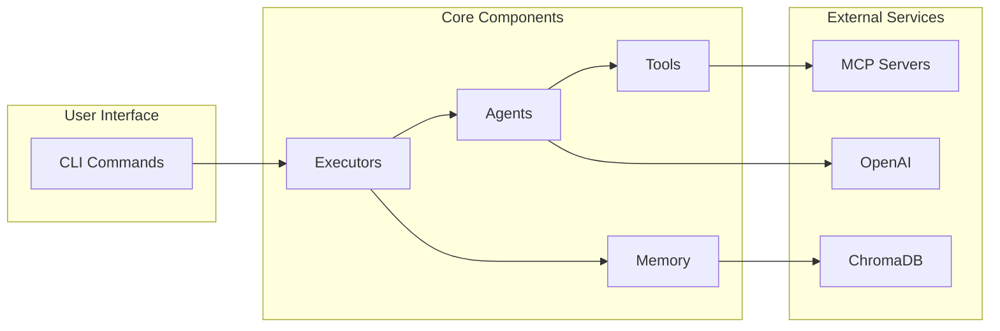
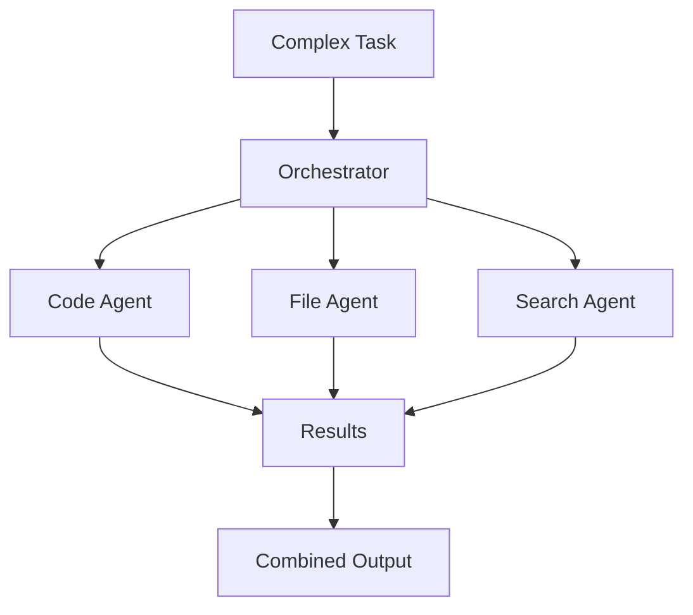

# Tron AI Documentation
> **⚠️ Warning**  
> These documents may not be 100% accurate. They were generated to help explain what this project is and what features it has. Please refer to the source code for the most up-to-date and accurate information.


Welcome to the Tron AI documentation. Tron AI is an advanced AI-powered agent orchestration framework built on top of AdalFlow and OpenAI, designed to coordinate multiple specialized agents for solving complex tasks.

## Quick Links

- **[Architecture Overview](architecture.md)** - System design and component interactions
- **[CLI Guide](cli-guide.md)** - Command-line interface usage and examples
- **[Agents Documentation](agents.md)** - Detailed agent system documentation
- **[API Reference](api.md)** - Complete API documentation
- **[Development Guide](development.md)** - Setup, testing, and contribution guidelines

## What is Tron AI?

Tron AI is a modular framework that provides:

- 🤖 **Multi-Agent Orchestration** - Coordinate specialized agents for complex tasks
- 🔧 **Flexible Executors** - Multiple execution strategies (completion, chain, agent-based)
- 🧠 **Memory Management** - Persistent context with vector database integration
- 🛠️ **Dynamic Tools** - Extensible tool system with MCP integration
- 📊 **Rich CLI** - Interactive interface with memory persistence

## System Overview



## Getting Started

### Installation

```bash
# Clone repository
git clone https://github.com/yourusername/tron-ai.git
cd tron-ai

# Install dependencies
pip install -e .

# Set up environment
export OPENAI_API_KEY=your-api-key
```

### Basic Usage

```bash
# Simple question
tron-ai ask "What is Python?"

# Interactive assistant
tron-ai assistant

# Complex task with agents
tron-ai agent "Analyze and improve this codebase"
```

## Documentation Structure

### 1. [Architecture](architecture.md)

Comprehensive system design documentation including:
- System overview and component interactions
- Executor patterns and strategies
- Agent system architecture
- Memory management design
- Tool system integration
- Error handling patterns

### 2. [CLI Guide](cli-guide.md)

Complete guide to using the command-line interface:
- Installation and setup instructions
- Detailed command documentation
- Usage examples and workflows
- Advanced features and configuration
- Troubleshooting common issues

### 3. [Agents](agents.md)

In-depth documentation of the agent system:
- Built-in agents (Code, Docker, File, MCP, Search)
- Agent architecture and communication
- Tool integration patterns
- Creating custom agents
- Best practices and optimization

### 4. [API Reference](api.md)

Complete API documentation covering:
- Executor classes and methods
- Agent base classes and interfaces
- Utility functions and helpers
- Data models and configurations
- Exception hierarchy

### 5. [Development Guide](development.md)

Developer documentation including:
- Development environment setup
- Testing strategies and examples
- Code standards and style guide
- Contribution workflow
- Debugging and optimization tips

## Key Features

### Multi-Agent Orchestration



### Execution Strategies

| Strategy | Use Case | Description |
|----------|----------|-------------|
| **Completion** | Simple Q&A | Direct LLM completion for straightforward queries |
| **Chain** | Multi-step reasoning | Sequential execution of related prompts |
| **Agent** | Complex tasks | Orchestrated execution with specialized agents |

### Memory System

The memory system provides:
- Automatic conversation storage
- Vector-based similarity search
- Time-based filtering
- Context augmentation for queries

## Example Workflows

### Code Analysis Workflow

```bash
# Analyze a Python project
tron-ai agent "Analyze the security and performance of all Python files"

# The system will:
# 1. File Agent scans for Python files
# 2. Code Agent analyzes each file
# 3. Results are combined and formatted
# 4. Detailed report is generated
```

### Interactive Learning

```bash
# Start an interactive session
tron-ai assistant "I want to learn about machine learning"

# Features:
# - Contextual responses
# - Memory of previous questions
# - Progressive learning support
# - Resource recommendations
```

## Development

### Project Structure

```
tron-ai/
├── tron_intelligence/
│   ├── cli.py              # CLI entry point
│   ├── executors/          # Execution strategies
│   │   ├── agents/         # Agent implementations
│   │   ├── base.py         # Base executor
│   │   ├── completion.py   # Simple completion
│   │   └── chain.py        # Chain execution
│   ├── models/             # Data models
│   ├── prompts/            # Prompt templates
│   ├── tools/              # Tool implementations
│   └── utils/              # Utilities
├── tests/                  # Test suite
├── docs/                   # Documentation
└── pyproject.toml         # Project configuration
```

### Contributing

We welcome contributions! Please see our contributing guidelines for:
- Code style and standards
- Testing requirements
- Pull request process
- Issue reporting

## Performance Considerations

### Optimization Tips

1. **Agent Selection** - Use only necessary agents for tasks
2. **Parallel Execution** - Enable for independent operations
3. **Memory Queries** - Limit time ranges for better performance
4. **Tool Usage** - Cache results when appropriate

### Benchmarks

| Operation | Average Time | Notes |
|-----------|--------------|-------|
| Simple completion | ~1-2s | Direct API call |
| Agent task | ~5-10s | Depends on complexity |
| Memory query | ~0.5s | Vector search |
| Multi-agent parallel | ~8-15s | Concurrent execution |

## Support

- **Documentation**: You're here!
- **Issues**: GitHub Issues
- **Discussions**: GitHub Discussions
- **Email**: support@tron-ai.dev

## License

Tron AI is released under the MIT License. See LICENSE file for details.

---

*This documentation is continuously updated. Last update: Current version* 