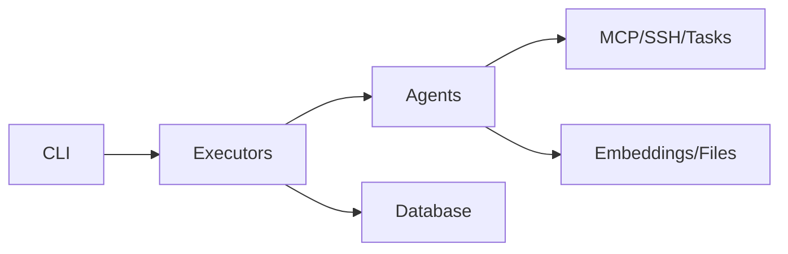

# Tron AI Documentation

Welcome to Tron AI, an AI agent framework with specialized agents for business, devops, and productivity tasks.

## Quick Links

- [Architecture](architecture.md)
- [CLI Guide](cli-guide.md)
- [Agents](agents.md)
- [API Reference](api.md)
- [Development Guide](development.md)

## What is Tron AI?

Tron AI is a modular framework for AI agents with multi-agent orchestration via swarm executor, MCP integration for tools, task management with dependencies, database for history, and processors for embeddings/files.

## System Overview



## Getting Started

### Installation

```bash
git clone https://github.com/yourusername/tron-ai.git
cd tron-ai
python -m venv .venv
source .venv/bin/activate
uv sync
```

### Environment

```bash
OPENAI_API_KEY=your-key
# Add keys for agents as needed
```

### Basic Usage

```bash
tron-ai chat "Hello" --agent tron
tron-ai scan_repo .
```

## Documentation Structure

- [Architecture](architecture.md): System components and flows
- [CLI Guide](cli-guide.md): Commands and usage
- [Agents](agents.md): Agent categories and details
- [API Reference](api.md): Classes and methods
- [Development Guide](development.md): Setup and contributing

## Key Features

- Multi-agent swarm orchestration
- Specialized agents across domains
- MCP for dynamic tools
- Task dependency management
- Conversation database
- CLI with chat and scanning

## Example Workflows

### Task Management

```bash
tron-ai chat "Create task: Buy milk" --agent todoist
```

### Code Analysis

```bash
tron-ai scan_repo /path/to/repo --store-neo4j
```

### Interactive Assistant

```bash
tron-ai chat "Plan my week" --agent tron
```

## Development

See [Development Guide](docs/development.md).

## License

MIT License.
